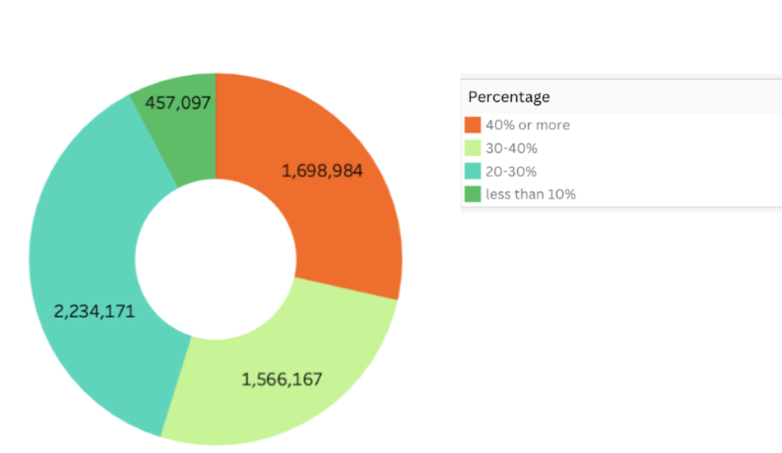

# NYC For-Hire-Vehicles
## Big Data Technologies - CIS 4130
### Nidhi Shah 

# Description
This project is a data solution designed to source, store, and model data from the NYC Open Data Source about For Hire Vehicles. It aims to provide a centralized repository for analyzing and visualizing tip amounts based on trip time, distance, etc. 

# Data
NYC Open Data Source about For Hire Vehicles. The data includes details such as pick-up/drop-off dates and times, locations, distances, fares, rate and payment types, and passenger counts. The NYC Taxi and Limousine Commission (TLC) received these records from authorized technology providers and bases under specific programs. The TLC emphasizes that they did not create the data and do not guarantee its accuracy. For FHV records, details include dispatching base license numbers, pick-up date/time, and taxi zone location ID, with the TLC acknowledging potential inaccuracies in the submitted data and performing routine reviews for enforcement and accuracy.

The data source can be found here: [For Hire Vehicles](https://www.nyc.gov/site/tlc/about/data.page)

## What I intend to predict 
From this data, I am planning to analyze the amount of tips based on trip time and trip distance. I will be using logistic regression to conduct my analysis because we are looking for a binary outcome. 

## Methods

### Sourcing and storing the data
+ To begin extracting and collecting the data from the NYC Open Data Source, I used a virtual machine instance to extract the data from the website. I used a curl function to download files from the web and save the output to a folder on the Google Cloud Platform. 
+ In the "[scripts](Scripts/Extracting)" folder, there is a code snippet that will automate the download from url

### Exploratory data analysis
+ Next, we begin by gathering basic information about the data by performing exploratory data analysis. For the NYC Taxi Data, using the code below, the following information was gathered:
    +  Number of Observations: 16054495
    +  List of variables, as well as the data type
    +  Number of Missing (null or N/A) fields in the observations:
    +  Originating_base_num: 6229158
    +  On_scene_datetime: 6229158
    +  Min/Max/Avg for all numeric values
    +  Statistics for numeric and date variables
        + Minimum/Maximum dates for data variables
        + Value Counts for Categorical Variables
          + Access_a_ride_flag: 
              N: 20503468
              Y: 12829
          + Wave_request_flag: 
              N: 20469302
              Y: 46995
    + Congestion Surcharge:
        

In the "[scripts](Scripts/EDA.ipynb)" folder, there is a code for the EDA

Based on the EDA that was performed, the datatype included in this dataset are datetime64[us](4), float64(9), int32(2), int64(1), and object(8). There are the same amount of missing values in the originating_base_num column and the on_scene_datetime column, which could be the result of missing data regarding the base or dispatch company that the taxi was sent from. These values can be missing because the taxis were called directly instead of through an agency. I was even able to print the statistics for the numeric variables after filtering outliers to get a better idea of the data without accounting for outlier data.

### Cleaning
To clean the data, I used a separate notebook to remove missing data, fill in missing values with averages where appropriate, and drop unnecessary columns (“dispatching_base_num” which was irrelevant to my data). Using the code, the appropriate data types were also applied to all columns (“request_datetime” was converted to a timestamp). 

This data was read from the “/landing” folder and moved to the “/cleaned” once it was cleaned. 

This is the [code](Scripts/Cleaning.ipynb) for the cleaning.

  Conclusions and Challenges: 
    This data is now cleaned and ready to be manipulated to find the correlation between tips and pick-up location. One challenge that I believe I will have in feature engineering is dealing with categorical values - I’ll need to encode them appropriately for the model. I also think I will face multicollinearity while handling this data because many factors may affect the tips a driver receives, and they may be highly correlated with each other. 

### Feature Engineering
To begin feature engineering, we must first understand the columns’ data types (float, integer, string), variable type (continuous or categorical), indexer, and scaler that we will have to complete for each column. Below is the table with those details outlined: 

Numerical features such as trip times, fares, and distances were scaled using the StandardScaler from the PySpark ML library to ensure consistent scaling across different features. Categorical features such as location IDs were indexed using StringIndexer to convert them into numerical values for modeling purposes. Additionally, feature vectors were created using VectorAssembler to combine all relevant features into a single vector for model training.

A Linear Regression model was chosen for predicting tips based on the engineered features. The dataset was split into training and testing sets, with 80% of the data used for training and 20% for testing. The Linear Regression model was trained using the training data and evaluated using Root Mean Squared Error (RMSE) on the testing data to assess model performance. I also added a CrossValidator, which has the main purpose of helping to prevent overfitting and to find the best-performing model by splitting the data into multiple subsets for training and validation. 

The RMSE for the test data using the CrossValidator is 0.00852733, which means that the model’s predictions are very close to the actual values in the testing data. In other words, the model performs exceptionally well in predicting the amount of tips based on the trip_time, base_passenger_fare, trip_miles, etc.

The results of the analysis, including the trained model and data with engineered features, were written to files in Google Cloud Storage. The trained Linear Regression model was saved in the Models/ folder, while the data with engineered features was saved in the Trusted/ folder. The outputs are organized and stored in a structured manner for easy retrieval and further analysis.

This analysis predicted tips based on NYC Taxi For-Hire Vehicle trip records using feature engineering and a Linear Regression model. Challenges encountered during feature engineering included handling missing values, scaling numerical features, and indexing categorical features. However, these challenges were effectively addressed using appropriate techniques from the PySpark ML library. The resulting code is automated and can be scripted for future use or integration into larger data pipelines.

The script is [here](Scripts/FeatureEngineering.ipynb)! 

### Visualizations

Next, I created visualizations for the NYC Taxi Dataset using Tableau and PySpark. Below are some of the visualizations: 

Using PySpark I plotted the actual tips vs the predicted tip amounts, along with the residuals. The code for this is [here](Scripts/Visualizing.ipynb).

In this bar chart, we can see the number of taxi trips on each day of the week for weekdays. This gives us insight onto what days are the most popular for taxi rides, therefore we can expect a larger tip sum. 

In this pie chart, we see the percentage of tip left by customers for each ride. The key provides insight into which tip percentage each color is, and the number indicated on the pie chart is the dollar amount.

This line chart shows the trend in number of taxi trips throughout the year 2021. We can see that there is a steep decrease during January 21 and June 4th, possibly corresponding to bank holidays that occur. 

This visualization depicts the frequency of rides during each time of day. I built this visualization using the circle bar chart - I used this video as a reference. We can see that there are fewer trips from midnight to sunrise, the most during the 9-12 pm period - I infer that this is because of late-night taxi rides from restaurants, bars, clubs, etc.

## Conclusions 
In the realm of data science and machine learning, predictive analysis is a powerful tool for extracting insights and making informed decisions. I used a comprehensive process of predictive analysis applied to the NYC Taxi For-Hire Vehicle dataset, specifically focusing on predicting tips received during taxi trips. It started with acquiring the data and moving through exploratory data analysis (EDA), data cleaning, feature engineering, model training, evaluation, data storage, and visualization.

To acquire the data, I tapped into the rich resources of the NYC Open Data Source. Using a virtual machine instance and the curl function, I downloaded data files and stored them on the Google Cloud Platform, setting the stage for our analysis and model development.

Next was the EDA phase, where I delved deep into the dataset's characteristics. I gathered essential statistics like the number of observations, data types, missing values, and categorical value counts. This step provided valuable insights into the dataset's structure and potential challenges lying ahead. Data cleaning emerged as a crucial step to ensure data quality and reliability. I tackled missing values, dropped irrelevant columns, and standardized data types, paving the way for accurate analysis.

During the feature engineering phase, I scaled numerical features like trip times, fares, and distances using StandardScaler for consistent scaling. Categorical features, such as location IDs, were transformed into numerical values using indexing techniques. The creation of feature vectors using VectorAssembler streamlined the data for model training.

Moving on to model training, I chose a Linear Regression model, ideal for predicting continuous variables like tips. The dataset was split into training and testing sets, with 80% for training and 20% for testing. Cross-validation fine-tunes model parameters and ensures robust performance. Evaluation was key in assessing the model's performance using metrics like Root Mean Squared Error (RMSE) on the testing data. A low RMSE value indicated high predictive accuracy, affirming the model's capability to forecast tip amounts effectively.

To ensure accessibility and reproducibility, I stored the results, including the trained Linear Regression model and data with engineered features, in Google Cloud Storage. This organized approach facilitated easy retrieval for future analysis and model refinement.

Visualization added the final touch, providing intuitive insights into model predictions. Using PySpark, I created scatter plots to visualize actual tips versus predicted tip amounts, along with a residual plot to understand prediction errors.

I used a lot of ChatGPT to help find syntax errors in my code, as well as find more efficient ways to ensure that my model was functioning correctly. 

The main conclusion I drew from the data was that trip times, played a significant part in the amount of tips a customer gave. Based on my model, and the visualizations, I can derive the conclusion that the reason for this is because there were more riders in the morning, hence more demand for taxis, meaning that customers who were able to get into a taxi will leave a larger tip. 

There is also a Github created for this assignment, which is linked here. 

This project was extremely challenging but rewarding. I feel that I learned a lot about big data and how to apply this knowledge to larger projects in the future. I hope to be able to continue to work with big data.

## Issues I ran into/Future Considerations
+ Working with big data was tough! I had to get a great grasp on how to most efficiently build this model to predict tips.
+ In the future, I would be sure to use tools that have more computing power to reduce the time it took to execute code.
+ I would also start with more of an outline of what tools, and processes I wanted to use to build my model. Since this was my first time, I was going in with just a general idea of what I wanted to do, but not with a clear understanding of what I NEEDED to do. 

